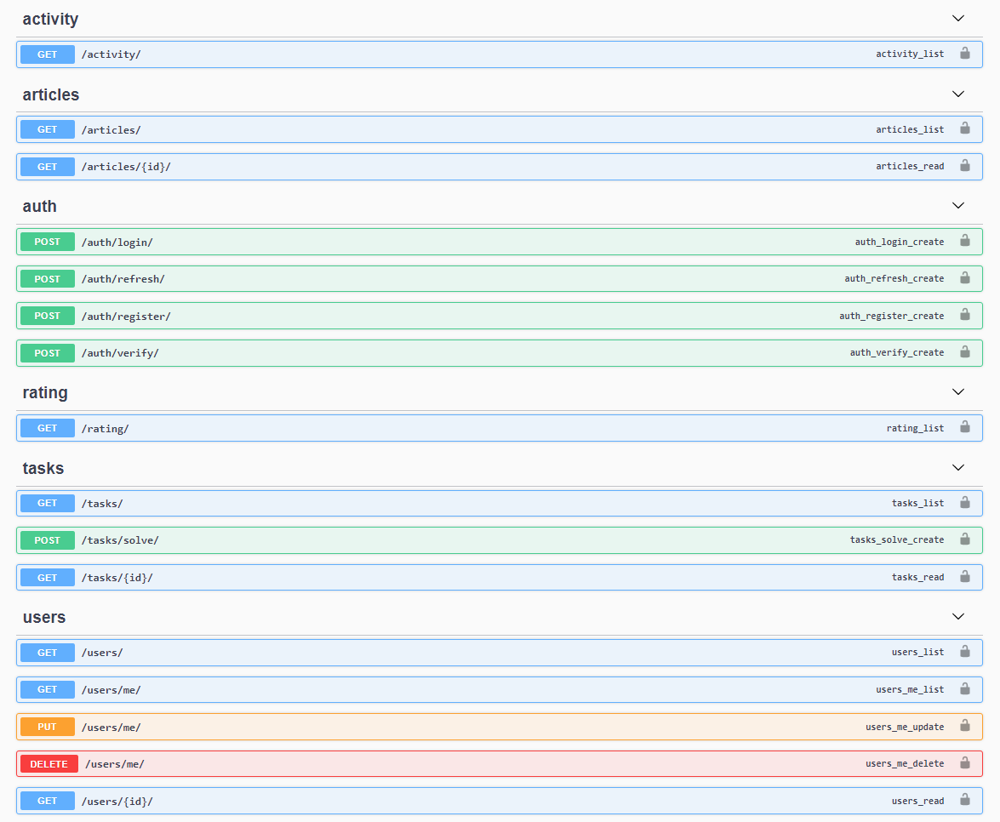

# Binary Exploits - backend


## Running

Create `.env` based on `.env.template` and configure environment variables. Then run following commands:

```bash
pipenv shell
pipenv install --system --deploy
python manage.py runserver 8000
```

Backend will be available at: `localhost:8000`

Admin panel: `localhost:8000/admin`

For production use for example gunicorn server (see [Dockerfile](./Dockerfile) and [Procfile](./Procfile))

## API Reference




## Screenshots


## Built with

- [Django](https://www.djangoproject.com/)
- [Django Rest Framework](https://www.django-rest-framework.org/)
- [Martor](https://github.com/agusmakmun/django-markdown-editor)
- [Django Simple JWT](https://django-rest-framework-simplejwt.readthedocs.io/en/latest/)
- [Django Rest Swagger](https://django-rest-swagger.readthedocs.io/en/latest/)

## Team

<table align="center">
<tr>
<th align="center">
    <br> 
    <a href="https://github.com/rivit98">Albert Gierlach</a>
</th>
<th align="center">
    <br> 
    <a href="https://github.com/kuczi55">Kamil Koczera</a>
</th>
<th align="center">
    <br> 
    <a href="https://github.com/def-au1t">Jacek Nitychoruk</a>
</th>
</tr>
</table>

<p align="center">
This project was created as our engineer's thesis.
</p>

